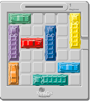
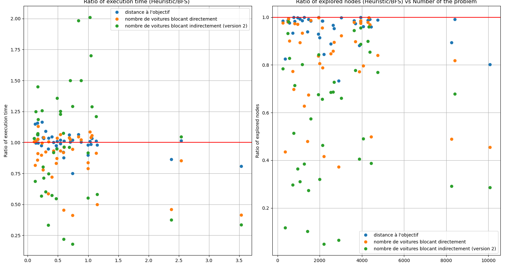

# INF421-RUSH-HOUR



[**English version bellow**](#project-overview)

## Introduction 

Ce projet a été développé dans le cadre du cours [CSC_42021_EP - Conception et analyse d'algorithmes](https://moodle.polytechnique.fr/enrol/index.php?id=19281) de l'école polytechnique. Il est encadré par [M. Coupechoux](https://www.telecom-paris.fr/marceau-coupechoux). Le but du projet est d'implémenter un algorithme efficace pour la résolution du problème du *rush hour* (à ne pas confondre avec la _masterclass_ de Jackie Chan & Chris Tucker) aussi connu sous le nom de *unblock-me*, dont on peut trouver une description détaillée [ici](https://fr.wikipedia.org/wiki/Rush_hour_(casse-t%C3%AAte)). Il s'agit d'un casse-tête de déplacements où le but est d'extirper la voiture rouge d'un embouteillage automobile. 

Le jeu peut facilement se transformer en un problème de graphe. La recherche du chemin le plus rapide pour la voiture rouge se fait alors en implémentant **Dijkstra**. Puis on peut explorer différentes heuristiques pour essayer d'être plus rapide dans notre recherche du chemin optimal.

## Installation 


```bash
pip install -r requirements.txt
git clone https://github.com/Hubert-LEROUX/GeoAnalysis.git
```

## Structure

- un répertoire `src/`, contenant tous les **codes sources** ;
  - Il contient notamment `src/explainatory_research.ipynb` qui contient l'exploration du projet ;
  - un fichier `src/tools.py` qui contient les __outils__ développés au fil de la recherche ;
  - un fichier `src/visualisation.py` contenant des fonctions permettant d'établir un __benchmarking__ ;
  - un fichier `src/tas.py` contenant l'implémentation basique d'un tas (nous avons ici utilisé directement celle de python dans un souci d'efficacité, mais le principe reste le même) ;
  - un fichier `src/hash_table` contenant l'implémentation de note __table de hachage__ ainsi que du __set__;
  - un fichier `src/run.py` qui permet de **résoudre** des problèmes en ligne de commande ;
  - un fichier `src/generate_game.py` qui permet de **générer des parties** en ligne de commande.
- un répertoire `lib/`, contenant toutes les **bibliothèques** intégrées dans le projet ;
- un répertoire `bin/`, contenant les **programmes exécutables** ;
- un fichier `README.md`, expliquant comment exécuter vos programmes (il doit décrire clairement les paramètres d'entrée de vos programmes) ;
- un répertoire `report/`, contenant le **rapport** du projet ;
- un répertoire `results/`, fournissant les **résultats** de votre programme ;
- un répertoire `examples/`, fournissant des **exemples** de jeux.

## Utilisation

Voici l'ensemble des signatures des fonctions du projet.
### Fonctions dans tools.py

- `get_input()`
- `get_input_from_file(file)`
- `is_point_in_grid(point, n)`
- `cars_into_grid(n, cars)`
- `set_game_from_file(file)`
- `show_grid(grid)`
- `copy_game_state(game_state)`
- `get_next_moves(game_state)`
- `distance_top_left(car)`
- `is_winning(game_state)`
- `brute_foce_BFS(game_state)`
- `brute_foce_BFS_from_file(file)`
- `deballe_solution(antecedent, game_state)`
- `brute_foce_BFS_with_solution(game_state)`
- `heuristic_BFS(game_state, heuristic=lambda x: 0)`
- `number_cars_blocking(game_state)`
- `distance_to_goal(game_state)`
- `number_cars_indirectly_blocking(game_state)`
- `improved_blocking_cars(game_state)`

### Fonctions dans visualisation.py

- `show_grid(grid)`
- `print_solution(game_state, solution)`
- `write_solution(game_state, solution, file)`
- `generate_results_BFS(nb_games=40)`
- `plot_BFS(nb_games=40)`
- `get_data_from_different_heuristic(heuristics_list, nb_games=40)`
- `plot_compare_BFS_vs_heuristic(heuristic, nb_games=40)`
- `plot_compare_heuristics(heuristics_list, nom_heuristiques, nb_games=40)`

### Classes dans hash_table.py

- `class My_hash_table`
  - `__init__(self, nb_cars=10, size=1000003)`
  - `__len__(self)`
  - `hash(self, key)`
  - `get(self, key)`
  - `add(self, key, value)`
  - `contains(self, key)`
  - `show_table(self)`

- `class My_set(My_hash_table)`
  - `add(self, key)`

### Classes dans tas.py

- `class My_heap`
  - `__init__(self)`
  - `find_id_father(self, id_child)`
  - `find_id_left_son(self, id_father)`
  - `find_id_right_son(self, id_father)`
  - `is_empty(self)`
  - `push(self, x)`
  - `pop(self)`

- `def heapify(l)`

Pour plus de précision voir la [documentation complète](./bib/documentation.md). Le [jupyter notebook](./src/explainatory_research.ipynb) décrit l'implémentation du projet dans l'ordre des questions. 

Enfin pour une utilisation en ligne de commande, il faut utiliser [run.py](./src/run.py) de cette façon :


```txt
usage: run.py [-h] [-i INPUT] [-H {distance_to_goal,number_cars_blocking,improved_blocking_cars}] [-o OUTPUT]

Solves the Rush Hour puzzle using a heuristic-based BFS.

options:
  -h, --help            show this help message and exit
  -i, --input INPUT     File path for the game configuration.
  -H, --heuristic {distance_to_goal,number_cars_blocking,improved_blocking_cars}
                        Heuristic function.
  -o, --output OUTPUT   Output file path.

Examples:
        1. Run the solver with an input file and print the solution:
            python run.py -i input.txt
            
        2. Run with a specific heuristic, then print the solution:
            python run.py -i input.txt -H distance_to_goal

        3. Run with an input file, a specific heuristic, and save the solution:
            python run.py -i input.txt -H number_cars_blocking -o output.txt

        4. Run with user input and print the solution:
            python run.py

        5. Use a specific heuristic with user input:
            python run.py -H improved_blocking_cars

```


## Résultats 

Voici un graphique résumant l'efficacité des différentes heuristiques implémentées. 




## Contribuer

Les contributions sont les bienvenues ! Veuillez forker le dépôt et créer une pull request avec vos modifications.

## Licence

Ce projet est sous licence MIT. Voir le fichier [LICENSE](LICENSE) pour plus de détails.

## Contact

Pour toute question, veuillez contacter [hubert.leroux@polytechnique.org](mailto:hubert.leroux@polytechnique.org).

---

## Project Overview

Rush Hour is a puzzle game where the objective is to move a red car out of a 6x6 grid full of other cars and trucks blocking its path. The game requires strategic thinking and planning to solve each level.


## Installation

```bash
pip install -r requirements.txt
git clone https://github.com/Hubert-LEROUX/GeoAnalysis.git
```

## Structure

- a `src/` directory, containing all the **source codes**. It notably contains:
  - `src/explainatory_research.ipynb` which includes the project's exploration;
  - a file `src/tools.py` which contains tools developed throughout the research;
  - a file `src/visualisation.py` containing functions for benchmarking;
  - a file `src/tas.py` containing the basic implementation of a heap (we used Python's built-in implementation for efficiency, but the principle remains the same);
  - a file `src/hash_table` containing the implementation of our **hash table** as well as the **set**;
  - a file `src/run.py` which allows solving problems via the command line;
  - a file `src/generate_game.py` which allows generating games via the command line;
- a `lib/` directory, containing all **libraries** integrated in the project;
- a `bin/` directory, containing the **executable programs**;
- a `README.md` file, explaining how to run your programs (it should clearly describe the input parameters of your programs);
- a `report/` directory, containing the project **report**;
- a `results/` directory, providing the **outputs** of your program;
- a `examples/` directory, providing **examples** of games.

## Utilization

Here are the function signatures for the project.

### Functions in tools.py

- `get_input()`
- `get_input_from_file(file)`
- `is_point_in_grid(point, n)`
- `cars_into_grid(n, cars)`
- `set_game_from_file(file)`
- `show_grid(grid)`
- `copy_game_state(game_state)`
- `get_next_moves(game_state)`
- `distance_top_left(car)`
- `is_winning(game_state)`
- `brute_foce_BFS(game_state)`
- `brute_foce_BFS_from_file(file)`
- `deballe_solution(antecedent, game_state)`
- `brute_foce_BFS_with_solution(game_state)`
- `heuristic_BFS(game_state, heuristic=lambda x: 0)`
- `number_cars_blocking(game_state)`
- `distance_to_goal(game_state)`
- `number_cars_indirectly_blocking(game_state)`
- `improved_blocking_cars(game_state)`

### Functions in visualisation.py

- `show_grid(grid)`
- `print_solution(game_state, solution)`
- `write_solution(game_state, solution, file)`
- `generate_results_BFS(nb_games=40)`
- `plot_BFS(nb_games=40)`
- `get_data_from_different_heuristic(heuristics_list, nb_games=40)`
- `plot_compare_BFS_vs_heuristic(heuristic, nb_games=40)`
- `plot_compare_heuristics(heuristics_list, nom_heuristiques, nb_games=40)`

### Classes in hash_table.py

- `class My_hash_table`
  - `__init__(self, nb_cars=10, size=1000003)`
  - `__len__(self)`
  - `hash(self, key)`
  - `get(self, key)`
  - `add(self, key, value)`
  - `contains(self, key)`
  - `show_table(self)`

- `class My_set(My_hash_table)`
  - `add(self, key)`

### Classes in tas.py

- `class My_heap`
  - `__init__(self)`
  - `find_id_father(self, id_child)`
  - `find_id_left_son(self, id_father)`
  - `find_id_right_son(self, id_father)`
  - `is_empty(self)`
  - `push(self, x)`
  - `pop(self)`

- `def heapify(l)`

For more details, see the [complete documentation](./bib/documentation.md). The [jupyter notebook](./src/explainatory_research.ipynb) describes the project implementation in the order of the questions.

Finally, for command-line usage, use [run.py](./src/run.py) as follows:

```txt
usage: run.py [-h] [-i INPUT] [-H {distance_to_goal,number_cars_blocking,improved_blocking_cars}] [-o OUTPUT]

Solves the Rush Hour puzzle using a heuristic-based BFS.

options:
  -h, --help            show this help message and exit
  -i, --input INPUT     File path for the game configuration.
  -H, --heuristic {distance_to_goal,number_cars_blocking,improved_blocking_cars}
                        Heuristic function.
  -o, --output OUTPUT   Output file path.

Examples:
        1. Run the solver with an input file and print the solution:
            python run.py -i input.txt
            
        2. Run with a specific heuristic, then print the solution:
            python run.py -i input.txt -H distance_to_goal

        3. Run with an input file, a specific heuristic, and save the solution:
            python run.py -i input.txt -H number_cars_blocking -o output.txt

        4. Run with user input and print the solution:
            python run.py

        5. Use a specific heuristic with user input:
            python run.py -H improved_blocking_cars
```

## Contributing

Contributions are welcome! Please fork the repository and create a pull request with your changes.

## License

This project is licensed under the MIT License. See the [LICENSE](LICENSE) file for details.

## Contact

For any inquiries, please contact [hubert.leroux@polytechnique.org](mailto:hubert.leroux@polytechnique.org).